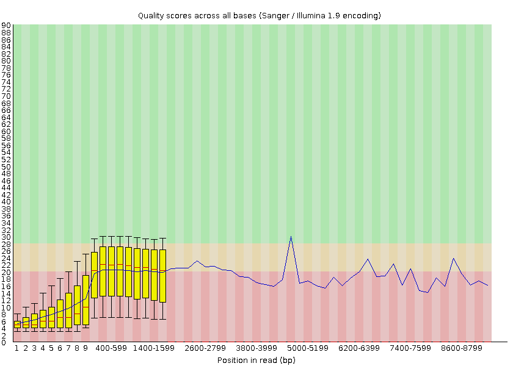

# Decifrando o genoma do SARS-Cov-2

O presente repositório contêm os *scripts* para análise de dados de sequenciamento
de DNA de um isolado de SARS-Cov-2, um coronavírus causar da doença COVID19. Os
dados usados de exemplo estão disponíveis no banco de dados NCBI SRA com o código de
acesso SRR24146463. Todos os *scripts* estão na pasta `scripts/`.

## Instalando as dependências

Para instalar as dependências do projeto, basta clonar o repositório e utilizar o 
alguma distribuição do conda (ex: anaconda, miniconda, miniforge, mamba) para
configurar o ambiente.

```bash
$ git clone https://github.com/fredericokremer/sars-cov-2
$ cd sars-cov-2
$ conda env create
```
Agora é necessário ativar o ambiente do Conda.

```bash
$ conda activate sars-cov-2
```

## Passo 1: download dos dados

Para baixar os dados do NCBI SRA podemos utilizar o *script* `step_1_download.sh` com o comando:

c
Este *script* utilizará a ferramenta `fastq-dump` para baixar os dados brutos de 
sequenciamento do NCBI SRA e salvará estes em um arquivo na pasta `data/raw` com o nome
`reads.fastq`.


## Passo 2: controle de qualidade

Agora utilizaremos a ferramenta `fastqc` para analisar a qualidade das leituras 
obtidas durante o sequenciamento. Para isso, vamos utilizar o *script* `step_2_quality_control.sh`:

```bash
$ bash scripts/step_2_quality_control.sh
```

O relatório do controle de qualidade ficará salvo
na pasta `data/raw_qc`. Com base nesse relatório, podemos escolher quais pedaços 
das leituras vamos "cortar" na próxima etapa.




## Passo 3: remoção de artefatos

Artefatos são regiões de baixa qualidade e/ou contaminantes presentes nas sequências lidas
pelo sequenciador. A partir do relatório de qualidade do `fastqc` podemos identificar estes
artefatos, e remover regiões onde eles estão ocorrendo. Para isso utilizaremos a ferramenta
`NanoFilt`, que pode ser executada com o *script* `scripts/step_3_remove_artifacts.sh`. As
leituras filtradas serão salvas na pasta `data/filtered`.

```bash
$bash scripts/step_3_remove_artifacts.sh
```

## Passo 4: identificação de variantes e montagem

Com os artefatos removidos, realizaremos a montagem do genoma do isolado de SARS-Cov-2
utilizando como referência o genoma da cepa originalmente isolada em Wuhan no começo da pandemia. Para isso primeiro é necessário se aplicar as leituras contra a referência utilizando a ferramenta `minimap2`, e depois aplicar algumas funções dos programas
`samtools` e `bcftools` para converter estes alinhamentos em uma sequência "consenso". Todas estas etapas podem ser realizadas com o *script* `step_4_variant.sh`, e os arquivos
intermediários ficarão salvos na pasta `data/variants`, sendo um deles o arquivo `genome.fasta`, que contêm a sequência do genoma montado.

```bash
$ bash scritps/step_4_variant.sh
```

## Passo 5: classificação da linhagem

Agora que temos o genoma montado, é possível se identificar a linhagem mais próxima (segundo a nomenclatura utilizada pela OMS) com da ferramenta `pangolin`, que pode ser executada com o *script* `step_5_classifiy.sh`. O resultado será o arquivo `data/classification/lineage_report.csv`, com a seguinte tabela:

|taxon                                                                                                                |lineage |conflict|ambiguity_score|scorpio_call                 |scorpio_support|scorpio_conflict|scorpio_notes                                                            |version     |pangolin_version|scorpio_version|constellation_version|is_designated|qc_status|qc_notes              |note                                                                                            |
|---------------------------------------------------------------------------------------------------------------------|--------|--------|---------------|-----------------------------|---------------|----------------|-------------------------------------------------------------------------|------------|----------------|---------------|---------------------|-------------|---------|----------------------|------------------------------------------------------------------------------------------------|
|new_isolate&#124;reference=NC_045512.2 Severe acute respiratory syndrome coronavirus 2 isolate Wuhan-Hu-1, complete genome|BA.1.1.1|0.0     |               |Probable Omicron (Unassigned)|0.72           |0.28            |scorpio call: Alt alleles 23; Ref alleles 9; Amb alleles 0; Oth alleles 0|PUSHER-v1.22|4.3             |0.3.19         |v0.1.12              |False        |pass     |Ambiguous_content:0.02|Usher placements: BA.1.1.1(1/1); scorpio found insufficient support to assign a specific lineage|

